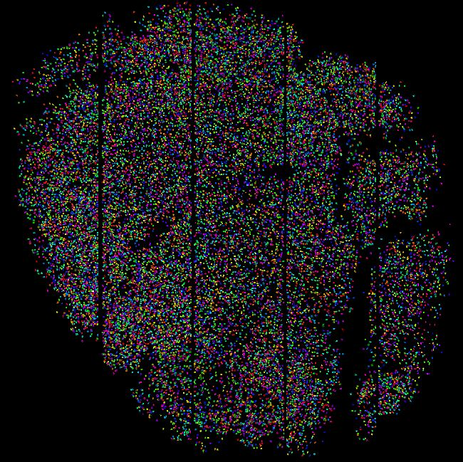

# Using rastermap to explore visual cortical activity

Code and data links are available here: https://github.com/MouseLand/rastermap/tree/master/tutorial

## Setting up

First start downloading the data from [here](https://drive.google.com/drive/u/0/folders/1fvnHDucsyBryVoWdo7u5YbaufoqDrsy9). It includes all the visual cortical responses, the behavioral responses aligned to the neural frames, and a short example video of the mouse's face. In this experiment we are showing sparse noise stimuli to the mouse (for retinotopic mapping) as it freely runs on an air-floating ball.

Next we will make an environment with all the packages that we need with the **conda** package manager using the `environment.yml` file:

1. Download the `environment.yml` from this folder *OR*
    1. Clone this repository `git clone https://github.com/MouseLand/rastermap.git` (or pull the latest version if you already have it with `git pull`)
    2. `cd rastermap/tutorial` to be in the same folder with the `environment.yml` folder.
2. Open an anaconda prompt (windows) / command prompt (linux/Mac) with `conda` for **python 3** in the path. In linux/Mac you can check which conda you have with `which conda`, it should be in a subfolder below `anaconda3`.
3. Run `conda env create -f environment.yml`.
4. To activate this new environment, run `conda activate mouseland`.
5. You should see `(mouseland)` on the left side of the terminal line. Now check that you can `python -m suite2p` or `python -m facemap` or `python -m rastermap`.

## View the data in [suite2p](https://github.com/MouseLand/suite2p)


^ 18,795 neurons in V1 ^

You will need 16GB of RAM to load this data into your computer. Start suite2p  with
```
python -m suite2p
```
From the file menu you can load the data (or with CTRL+L), choose the `stat.npy` file.

You can view the correlations among neurons with the *correlations* color. If you want to bin the responses a certain before computing the correlations, you can use the *bin=* text edit box. The data is collected with an imaging rate of 3Hz, so 3 bins = 1 second. Some neurons are correlated with their neighbors, others aren't. Why might that be?

## Retinotopy

We will now compute the receptive fields of single neurons, using the [tutorial.ipynb](tutorial.ipynb) notebook. 

## Dimensionality reduction

What are the overall patterns of activity in visual cortex? Are they well-defined by the principal components? We will look at the PCs in the notebook and their receptive fields.

Maybe there is a better way to visualize this activity. We can run *rastermap* from inside *suite2p* in the Visualizations menu (or with CTRL+V). You can then look at different groups of neurons in the main GUI by circling them with the RED ROI box in the top plot, and then clicking "show selected cells in GUI".

We can also run *rastermap* inside the notebook and look at the receptive fields of groups of neurons placed together in the embedding. These receptive field estimates will be less noisy. But what are these neurons doing which don't have clear receptive fields?

## Behavioral analysis with [facemap](https://github.com/MouseLand/facemap)

Run
```
python -m facemap
```

Then open the video "cam1_TX39_20Hz.avi" in facemap (this is a subset of the video). You can process this small subset of data in the GUI.

I've run facemap on the whole movie and aligned them to the neural frames for you. So now let's see how the behavior relates to the neural activity in the [tutorial.ipynb](tutorial.ipynb) notebook.

## BONUS: Explore data in [rastermap](https://github.com/MouseLand/rastermap) GUI

These neural responses are high-dimensional, is a one-dimensional embedding enough to view the structure? We can also embed the neurons in a 2D space using *rastermap*. Run
```
python -m rastermap
```
Load in the data (`spks.npy`) and then run 2D *rastermap*.


